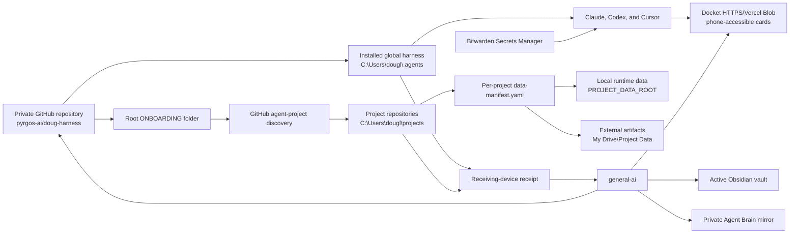

# General AI project map

## Core documents

| File | Loaded or read when | Owns |
|---|---|---|
| `AGENTS.md` | Every repository session | Portable project contract |
| `CLAUDE.md` | Every Claude repository session | Claude import of `AGENTS.md` |
| `.cursor\rules\00-project-contract.mdc` | Every Cursor repository session | Cursor pointer to `AGENTS.md` |
| `TASK.md` | Start, resume, handoff | Active goal, queue, constraints, completion evidence, and next verifier |
| `STATUS.md` | Start, resume, milestone | Durable current capability and boundaries |
| `LOG.md` | Recent history and handoff | Append-only completed-work record |
| `BACKBURNER.md` | Planning | Parked work |
| `MAP.md` | Architecture or path work | Architecture, data flow, owners, integrations, and navigation |
| `MIGRATION.md` | Legacy recovery review | Cutover ledger and preserved-data evidence |
| `MEMORY.md` | Recall | Lean links to durable references |
| `research\` | Research review | Historical recons, briefs, and specifications |
| `data-manifest.yaml` | External-data access | Value-free local-data policy |
| `secret-manifest.json` | Credential-dependent setup | Value-free runtime-variable inventory |
| `skills-manifest.json` | Skill selection and export | Project skill bindings |
| `CROSS-DEVICE-ACCESS.md` | Phone, computer, or cloud-agent pickup | Current human entrypoint and ordered links |
| `PORTABILITY-INVENTORY.yaml` | Receiving-device project discovery | Machine-readable action and transport state for 27 retained roots |
| `handoffs\CROSS-DEVICE-CONTEXT-2026-07-31-v2.json` | Agent pickup | Machine-readable commits, paths, blockers, and boundaries |
| `handoffs\RECEIVING-DEVICE-RECEIPT.schema.json` | Real receiving-computer verification | Value-safe structure for the final reconstruction receipt |

## System map

## Authorities and important paths

| Authority | Path or endpoint | Role |
|---|---|---|
| Shared harness source | `C:\Users\dougl\projects\agent-harness` | Local checkout of `pyrgos-ai/doug-harness` |
| Installed harness | `C:\Users\dougl\.agents` | Live shared rules, skills, tools, hooks, and human guide |
| Receiving workflow | `agent-harness\ONBOARDING\START-HERE.md` | ZIP/clone bootstrap entry point |
| Project coordination | `C:\Users\dougl\projects\general-ai` | This repository |
| Project source fleet | `C:\Users\dougl\projects` | Canonical local repository roots |
| External project artifacts | `C:\Users\dougl\My Drive\Project Data` | DVC objects, verified SQLite snapshots, and declared assets |
| Docket source | `C:\Users\dougl\projects\docket` | Phone-accessible review-card application |
| Historical recovery | `recovery\general-claude-history.bundle` | Complete committed-ref bundle for retained `general-claude` history |
| Shared research | `research\` | Committed architecture, task, second-brain, and graph-planning research |
| Cross-device entrypoint | `CROSS-DEVICE-ACCESS.md` | Ordered phone-safe links and current reconstruction blockers |
| Fleet inventory | `PORTABILITY-INVENTORY.yaml` | Guarded clone, attention, skip, and fixture-exclusion actions |
| Receiving receipt schema | `handoffs\RECEIVING-DEVICE-RECEIPT.schema.json` | Twelve-section, value-safe proof envelope tied to an exact harness commit |
| Agent Brain | `https://github.com/douglaspmcgowan/obsidian-vault-mirror` | Curated cloud context and constrained proposal/agent-note branches |

The Drive Capsule has no active authority. Its former folder was removed recoverably after repository onboarding passed. `My Drive\Project Data` remains an intentional external data path.

## Data and onboarding flow

1. A receiving computer downloads an authenticated repository ZIP or clones `pyrgos-ai/doug-harness`.
2. `ONBOARDING\START-HERE.md` routes the reviewed Windows bootstrap, harness installation and verification, approved Obsidian configuration restore, executable discovery, and project-data environment setup. The current released commit still requires the three harness blockers listed in `TASK.md` before final receiving-computer proof.
3. GitHub topic `agent-project` discovers the project fleet. Missing repositories clone under local conventions; clean existing repositories may pull safely.
4. Git carries source, instructions, manifests, portable fixtures, and value-safe documentation.
5. Each repository's `data-manifest.yaml` declares excluded runtime data and its adapter. `PROJECT_DATA_ROOT` holds local runtime state; `PROJECT_DATA_SYNC_ROOT` resolves to `C:\Users\dougl\My Drive\Project Data` on this computer.
6. DVC carries versioned content pointers in Git and immutable content-addressed bytes through the declared external artifact root. SQLite adapters create verified recovery snapshots under the 2/2/1 policy.
7. Bitwarden Secrets Manager supplies approved runtime credentials through the exact-command broker. Git receives names and safe placeholders only.
8. Docket makes briefs and decisions available on phone and other devices through its authenticated HTTPS/Vercel Blob path.
9. The private Agent Brain mirror supplies curated context to cloud agents. Agent-authored changes use reviewed branches under `proposals/` and `agent-notes/`; a future trusted bridge owns reviewed import into the personal vault.
10. The future cloud rollout follows `agent-harness\ONBOARDING\CLOUD-AGENTS.md` and issue #16. Planning does not grant cloud-ready status.
11. The real receiving run writes one dated receipt conforming to `handoffs\RECEIVING-DEVICE-RECEIPT.schema.json`; the receipt records hashes, statuses, and value-safe identifiers while excluding credential values and protected data contents.

## Integrations

| System | Direction | Authentication boundary | Failure behavior |
|---|---|---|---|
| GitHub | Both | GitHub credential store or hosted-agent credential | Stop clone, pull, or publication; preserve local Git state |
| Bitwarden Secrets Manager | Inbound | Existing machine-account token through exact-command broker | Fail closed without writing values to files or logs |
| Google Drive Project Data | Both through declared adapters | Google Drive Desktop session | Report adapter attention; preserve local data and last verified recovery point |
| Docket | Both | Existing `REVIEW_SECRET` and committed non-secret endpoint | Preserve local/outbox state and reject unauthorized or invalid writes |
| Obsidian | Outbound publication | Active vault selected from Obsidian configuration | Back up before replacement and avoid prohibited paths |
| Claude, Codex, Cursor | Inbound rules and project writes | Product-owned sessions | Continue from repository contract when local shared files are unavailable |

## Current research

- `research\obsidian-second-brain-recon-2026-07-30.md`
- `research\obsidian-second-brain-spec-2026-07-30.md`
- `research\graph-engineering-agent-planning-recon-2026-07-30.md`
- `research\graph-aware-agent-planning-spec-2026-07-30.md`
- `research\task-management-recon-2026-07-29.md`

## State

- `C:\Users\dougl\projects\general-ai` is the coordination repository for cross-agent harness work, project inventory, migration evidence, and shared research; its remote is `https://github.com/douglaspmcgowan/general-ai.git`. Repository `master` is the live coordination and inventory authority.
- `C:\Users\dougl\projects\agent-harness` is the local checkout of the private canonical harness repository `pyrgos-ai/doug-harness`; the reviewed source installs to `C:\Users\dougl\.agents`.
- `C:\Users\dougl\My Drive\Project Data` is the external artifact transport for DVC objects, verified SQLite snapshots, and other declared project assets, via project-owned `data-manifest.yaml` adapters.
- SQLite snapshot retention defaults to 2 daily, 2 weekly, and 1 monthly bucket; the newest verified snapshot always survives and the union retains at most five distinct snapshots. Projects may override all three nonnegative counts.
- Bitwarden Secrets Manager reuses the existing `Agents` organization, `Agent Runtime` project, `REVIEW_SECRET`, and connected machine account; the exact-command broker uses the machine token without putting credential values in Git.
- GitHub topic `agent-project` is the repository-discovery authority. Repository source and value-safe configuration travel through Git; excluded runtime data travels only through declared project-data adapters.
- The cloud-ready repository rollout is planning-only, tracked on `pyrgos-ai/doug-harness` branch `codex/cloud-ready-repositories` at commit `4bbb2fd` and in issue [#16](https://github.com/pyrgos-ai/doug-harness/issues/16). No repository has earned cloud-ready status.
- Harness `master` at `ae3899a` still lacks the pinned community-plugin installation path for the live Obsidian bundle, the exact two-path mutable-runtime verifier allowance, and prerequisite discovery ordered ahead of dependent Obsidian/Project Data stages. Harness [issue 18](https://github.com/pyrgos-ai/doug-harness/issues/18) is the consolidated owner for these receiving-device blockers and the final receipt.
- The retired Drive Capsule distribution and `C:\Users\dougl\OneDrive` have no active authority; Drive Capsule was moved recoverably to the Recycle Bin, and OneDrive retirement (application retired, local tree/legacy worktree registrations preserved) awaits an exact audit before move or removal.

### Remaining boundaries

1. Publish the current Obsidian bundle, mutable-runtime verifier repair, and blank-profile prerequisite-order repair through the harness owner's reviewed branch, then install merged `master`.
2. Run the full receiving-computer flow and preserve a receipt tied to the merged harness commit.
3. Resolve the remaining project-data attention actions in `PORTABILITY-INVENTORY.yaml`: seventeen project data manifests remain placeholders, Bible Name Search's declared DVC/SQLite generations remain unpublished pending its adapter-root reconciliation, and Docket has the sole operational cloud-data adapter. The later backup-preserving portable-hook migration remains owned by harness [issue 17](https://github.com/pyrgos-ai/doug-harness/issues/17).
4. Keep `C:\Users\dougl\My Drive\Project Data` intact while project manifests and adapters are reconciled.
5. Treat `C:\Users\dougl\OneDrive` as a separate preserved-data retirement project pending its exact audit.
6. Keep cloud-ready repository implementation, Agent Brain automation, and optional kernel-pool experimentation parked until their explicit rollout tasks begin.

## Ownership and concurrency

- One repository has one canonical local path.
- One writable task has one branch, one isolated worktree, and one owner.
- `TASK.md` is the task authority. UI task boards mirror its actionable slice.
- Shared runtime data remains read-only unless a task explicitly owns its mutation.
- Architecture changes update this map; durable capability changes update `STATUS.md`; meaningful completion appends to `LOG.md`.
