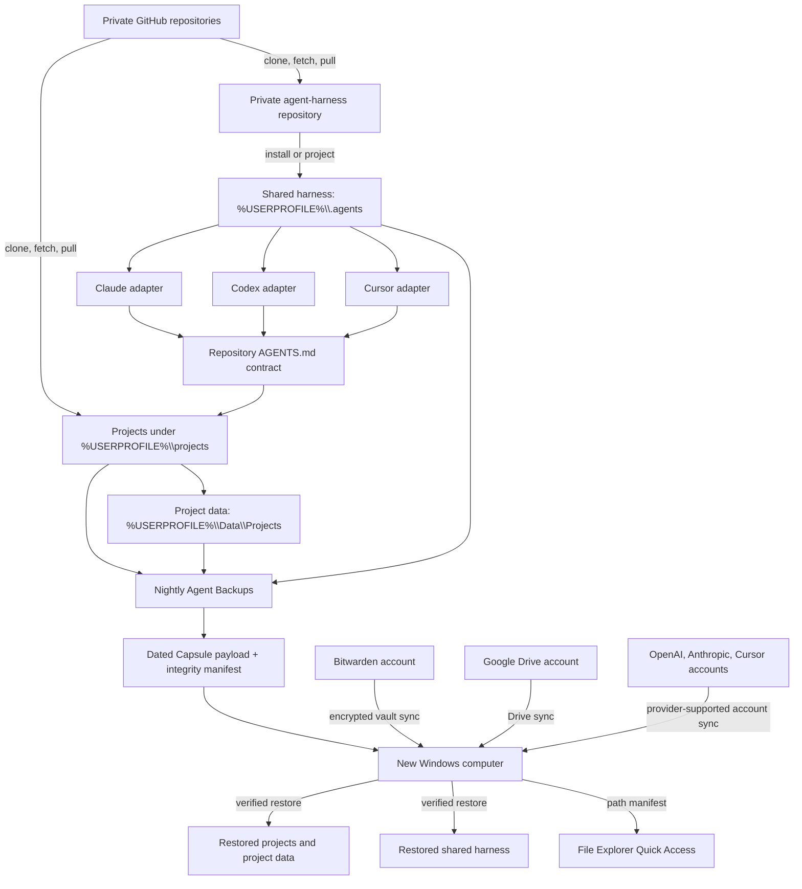

# Portable harness system map



## Authority map

| Concern | Authority | Portable representation |
|---|---|---|
| Credentials | Bitwarden Password Manager Free | Account identifier and broker tuple metadata |
| Repository history | GitHub remotes plus offline Git bundles | `payload\workspace\...\Handoffs` |
| Uncommitted work | Nightly Agent Backups | Binary Git patches and approved untracked files |
| Shared behavior | `%USERPROFILE%\.agents` | `payload\harness\.agents` |
| Claude behavior | Shared contract plus Claude adapter | Approved product configuration |
| Codex behavior | Shared contract plus repository `AGENTS.md` | Repository bundle and shared harness |
| Cursor behavior | Shared contract plus `.cursor\rules` | Repository bundle and approved product configuration |
| Runtime application data | `%USERPROFILE%\Data\Projects\<project>` | `payload\workspace\...\Application Data\Projects` |
| File Explorer pins | Portable path manifest | `Recovery\quick-access.json` |
| Google Drive documents | Google Drive account | Resynced from Google after login |
| Machine rebuild | Capsule | Bootstrap script plus SHA-256 integrity manifest |

## Update routes after installation

| Change made on computer A | How computer B receives it |
|---|---|
| A committed project change | Push to GitHub; fetch and integrate on B |
| A safe shared-harness change | Push the private harness repository; pull and project it on B |
| A local uncommitted change | Capture a later Agent Backups snapshot and refresh Capsule |
| A mutable project-data change | Capture a later approved project-data snapshot and refresh Capsule |
| A Google Drive document change | Google Drive synchronization |
| A Bitwarden vault change | Bitwarden vault synchronization |
| A provider-side account change | Sign into the same provider account |
| A Quick Access pin change | Capture a later Quick Access manifest and repair pins on B |

See `DATA-SYNC-AND-RETENTION.md` for exclusions, the current retention state, and GitHub transport choices.

## Startup chain inside a project

1. The application loads its local product adapter.
2. The adapter points to the shared cross-agent contract.
3. The repository's `AGENTS.md` supplies the portable project contract.
4. `CURRENT-TASK.md`, `WORK_QUEUE.md`, `STATUS.md`, and `LOG.md` restore task state.
5. `MAP.md`, `DESIGN.md`, `VERIFY.md`, manifests, and project skills provide navigation and validation.
6. Runtime data is resolved through `PROJECT_DATA_ROOT`.
7. Secret values enter only through the approved Bitwarden broker tuple.

## Folder reading order

An agent starts at `AGENT-START.md`. A human starts at `START-HERE.md`. Both paths converge on this map, `DATA-SYNC-AND-RETENTION.md`, and `SECRETS-BITWARDEN.md` before bootstrap or secret use.

## Verification on the receiving computer

```powershell
powershell.exe -NoProfile -ExecutionPolicy Bypass -File "$env:USERPROFILE\Documents\Capsule\tools\Verify-Capsule.ps1" -CapsuleRoot "$env:USERPROFILE\Documents\Capsule"
& "$env:USERPROFILE\.agents\tools\Test-HarnessSetup.cmd"
& "$env:USERPROFILE\.agents\tools\Test-AgentProjectState.cmd" -Repository "$env:USERPROFILE\projects\general-ai"
git -C "$env:USERPROFILE\projects\general-ai" status --short --branch
```
