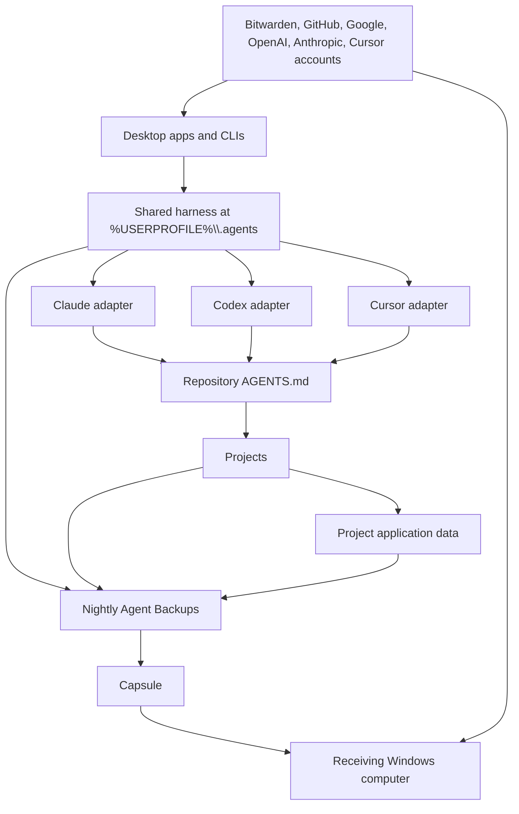

# Capsule and general-ai recovery handoff

Date: 2026-07-27

## Decision

Bitwarden Password Manager Free is the local credential authority. Each project or application uses a dedicated vault item and hidden custom fields named after its environment variables. The shared broker releases one selected field only when the item, field, destination variable, executable, and full argument list match an approved tuple.

Capsule is the transferable computer-rebuild package at:

```text
C:\Users\dougl\Documents\Capsule
```

The coordination repository is:

```text
C:\Users\dougl\projects\general-ai
```

The earlier `general-claude` folder remains a rollback copy while the creating session is active.

## Connections



## Receiving-computer sequence

1. Copy Capsule into the receiving profile's `Documents` folder.
2. Run `tools\Verify-Capsule.cmd`.
3. Run `tools\Bootstrap-Capsule.cmd`.
4. Sign into Google Drive, Bitwarden, GitHub, Claude, Codex, and Cursor with the identifiers in `manifests\accounts.json`.
5. Follow `SECRETS-BITWARDEN.md` to unlock Bitwarden and verify the full-tuple broker.
6. Open `projects\general-ai\general-ai.code-workspace`.
7. Run the shared harness and project verifiers.

## Manual boundaries

- Fill the value-safe account identifiers with `Capsule\tools\Set-CapsuleAccounts.cmd`.
- Run `Capsule\tools\Refresh-Integrity.cmd` after editing those identifiers.
- Run `gh auth login` on this computer and the receiving computer before GitHub publication or remote updates.
- Product sessions are recreated through each application's normal login.
- Restricted project data follows its project-specific recovery plan.
- The private harness commit `af6dd49` is local until GitHub authorization is refreshed.

## Verification result

- Capsule payload: snapshot `20260727-capsule5`, 5,731 files, roughly 114 MB scanned by Gitleaks.
- Full disposable restore: PASS for all 25 projects, canonical `general-ai`, approved application data, UTF-8 filenames, and portable `.agents`.
- Offline bundle proof: every captured bundle cloned into an empty temporary repository during backup.
- Recovery fallbacks: six clean current-tree bundles; three tracked files omitted after redacted Gitleaks reports and recovered from GitHub after login.
