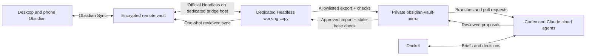

# Obsidian Headless scoping run

## Recommendation

Proceed with a controlled prototype of the official Obsidian Headless client in a dedicated bridge environment. Keep the active desktop vault at `C:\Users\dougl\Main\Yoga 7 Local John 1412` under the Obsidian desktop application's Sync client. Give cloud agents the existing private Git mirror, `douglaspmcgowan/obsidian-vault-mirror`, through ordinary branches and pull requests. A trusted bridge imports and exports only approved, allowlisted vault content.

The current Windows desktop should not host continuous Headless Sync while desktop Sync is active. Obsidian warns that running both sync clients on one device can cause conflicts. The first live prototype therefore belongs on a dedicated host, VM, or computer where the desktop Sync client is absent or disabled.

## What this run did

- Resolved the active Obsidian vault from `%APPDATA%\obsidian\obsidian.json`.
- Inspected the active vault's value-safe plugin and Sync configuration state.
- Identified the `ob` executable currently selected by Windows.
- Ran the official Obsidian Headless package in a disposable `npx` invocation.
- Listed official locally configured Headless vaults with identifiers and paths suppressed.
- Inspected the existing private Git mirror through value-safe GitHub metadata.
- Searched the harness and coordination repositories for an existing Headless bridge owner before proposing a new one.

This run did not authenticate to Obsidian, list remote vaults, attach a directory, change Sync settings, download vault content, upload vault content, or start continuous synchronization. Obsidian account login state remains unverified.

## Machine findings

| Check | Finding | Consequence |
|---|---|---|
| Node.js | `v24.15.0` | Meets the official client's Node 22+ requirement. |
| npm | `11.12.1` | Can run a pinned official package. |
| Windows `ob` resolution | WinGet package `Belphemur.ObsidianHeadless`, version `0.3.4` | This is a community Go client and should not be mistaken for Obsidian's official package. |
| Resolved `ob.exe` trust | SHA-256 recorded locally; Authenticode status `NotSigned` | Preserve it for now, but exclude it from the official bridge launcher. |
| Official client smoke test | `obsidian-headless@0.0.14` returned version and command help successfully | The official package runs on this machine without installation. |
| Official local configurations | One local Headless configuration was returned | Its identifying details were deliberately suppressed. |
| Active vault attachment | The active `Yoga 7 Local John 1412` vault was absent from the official local Headless configuration | No evidence shows the live vault is attached to official Headless. |
| Active vault core Sync | Enabled | Continuous Headless on this desktop would violate the documented one-sync-client-per-device safety boundary. |
| Active vault Web Viewer | Disabled | The separately approved Obsidian bundle still needs its plugin/configuration installation pass. |
| Active vault community-plugin manifest | Absent | Community plugin installation has not yet been recorded in this vault. |
| Existing bridge automation | No Headless bridge owner or launcher found in the searched harness/project roots | Add one owner during implementation rather than scattering scripts. |
| Git mirror | Private `douglaspmcgowan/obsidian-vault-mirror`, default branch `main`, active on 2026-07-31 | Reuse this repository as the cloud-agent surface. |

## The client collision

Two separate products use the `ob` command name:

1. Obsidian's official open-beta npm package, `obsidian-headless`.
2. The installed community WinGet package maintained by Belphemur.

The community project's own documentation identifies it as third-party and unsupported by Obsidian. A generic `ob` call currently selects that executable. The bridge should invoke a pinned official package through a repository-owned launcher and package lock. This removes PATH ambiguity and makes upgrades reviewable. Deleting the community client is unnecessary during scoping.

## Proposed topology

### Ownership

- **Personal authoring:** active Obsidian vault on desktop and phone.
- **Cross-device personal transport:** Obsidian Sync.
- **Cloud-agent workspace:** private Git mirror.
- **Credentialed transport:** dedicated Headless bridge host.
- **Human review:** Docket and GitHub pull requests.
- **Protected paths:** remain excluded from reads, exports, links, mirrors, and delegated work.

## Proposed bridge paths

These are implementation targets; this scoping pass did not create them.

- Headless working copy: `C:\AgentData\ObsidianBridge\remote-vault`
- Validated export staging: `C:\AgentData\ObsidianBridge\staging`
- Git working copy: `C:\AgentData\ObsidianBridge\obsidian-vault-mirror`
- Bridge implementation owner: the existing `obsidian-vault-mirror` repository under `tools/bridge/`
- Bridge configuration: value-safe allowlists and exclusions committed beside the bridge tools
- Credentials: host-local Obsidian Headless configuration or a dedicated secret broker; never committed to the vault or Git mirror

Using a short service path avoids user-profile assumptions and makes the host role explicit. A Linux or cloud host can use equivalent directories declared through environment variables.

## Credential and permission boundary

The Headless bridge needs access to the Obsidian account, any configured multi-factor challenge, and the remote vault's encryption password when applicable. The official client stores authentication state for later commands and removes stored credentials when a vault is unlinked or the client logs out. Exact storage protections should be inspected on the chosen bridge host before production use.

Routine cloud agents should receive:

- GitHub access to the private mirror;
- branch and pull-request permissions appropriate to the task;
- Docket access through its existing broker;
- committed schemas, writing protocols, exclusion rules, and verification commands.

Routine cloud agents should not receive Obsidian account credentials or direct write access to the remote vault. This keeps an agent mistake reviewable through Git and limits the credential-bearing component to one trusted bridge.

## One-time implementation sequence

1. Choose a dedicated bridge host that will not run the Obsidian desktop Sync client.
2. Create the three bridge directories and a dedicated operating-system account or tightly scoped service identity.
3. Add a pinned official `obsidian-headless` dependency and launcher to the existing private mirror repository.
4. Back up the remote vault through Obsidian's supported recovery/version-history path before first attachment.
5. Authenticate interactively on the bridge host; keep passwords and MFA responses out of logs and command arguments.
6. Attach the dedicated Headless working copy to the existing remote vault.
7. Begin in `pull-only` or `mirror-remote` mode and run a one-shot download.
8. Export only approved folders into staging. Enforce the harness prohibited paths plus repository-specific exclusions.
9. Verify path exclusions, deterministic file inventory, Markdown/frontmatter parsing, link integrity, size limits, and secret scanning.
10. Commit the safe export to a branch in `obsidian-vault-mirror`; review its diff before updating `main`.
11. Give cloud agents repository access and require their writes to arrive through branches or pull requests.
12. Prototype the reverse import with a disposable fixture, stale-base detection, a pre-import snapshot, and a receipt before allowing any live writeback.

## Initial operating mode

The safest first release is a one-way export from Obsidian Sync to Git. It gives cloud agents current readable context while every change back to the vault remains human-reviewed. Bidirectional import becomes a separate acceptance gate after the fixture proves conflict handling, deletion behavior, renames, attachment handling, and rollback.

Suggested schedule after the prototype passes:

- one-shot Headless pull;
- allowlisted export and verification;
- commit only when content changed;
- cloud work through pull requests;
- reviewed import as an explicit transaction;
- no continuous loop until duplicate-run locking and conflict recovery are proven.

## Gates before live synchronization

- Dedicated bridge host selected.
- Official launcher cannot resolve the third-party `ob.exe`.
- Remote-vault backup confirmed.
- Exclusion list covers every harness prohibited path.
- Export fixture proves omitted content never enters Git staging.
- Import fixture proves stale-base rejection, backup, rollback, rename, delete, and attachment behavior.
- One process lock prevents overlapping bridge runs.
- Logs contain paths, counts, hashes, and outcomes without account IDs or credential values.
- GitHub branch protection and cloud-agent permissions are set.
- Docket receives sync failures and import decisions.

## Decision

**Scoped recommendation: proceed to a fixture-only bridge prototype.** Keep the current live vault untouched until the dedicated host, pinned official launcher, exclusion verifier, backup, and rollback gates pass.

## Sources

- [Official Obsidian Headless overview](https://obsidian.md/help/headless)
- [Official Headless Sync setup and safety guidance](https://obsidian.md/help/sync/headless)
- [Official `obsidianmd/obsidian-headless` repository](https://github.com/obsidianmd/obsidian-headless)
- [Belphemur client documentation and third-party disclaimer](https://belphemur.github.io/obsidian-headless/)

## Evidence date

Machine and repository checks were performed on 2026-07-31. Version and product-state claims should be rechecked immediately before installation because Obsidian Headless remains an open beta.
